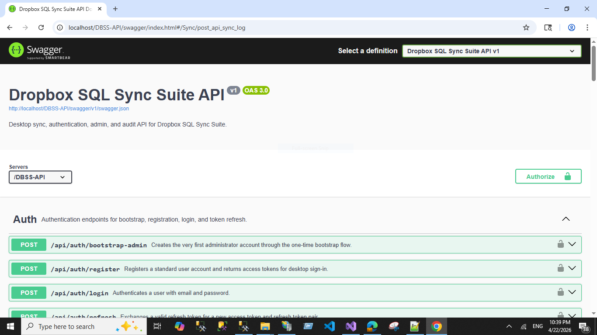
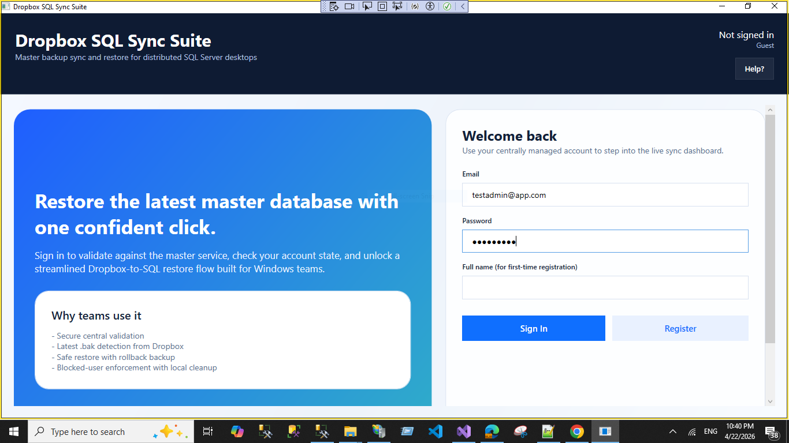
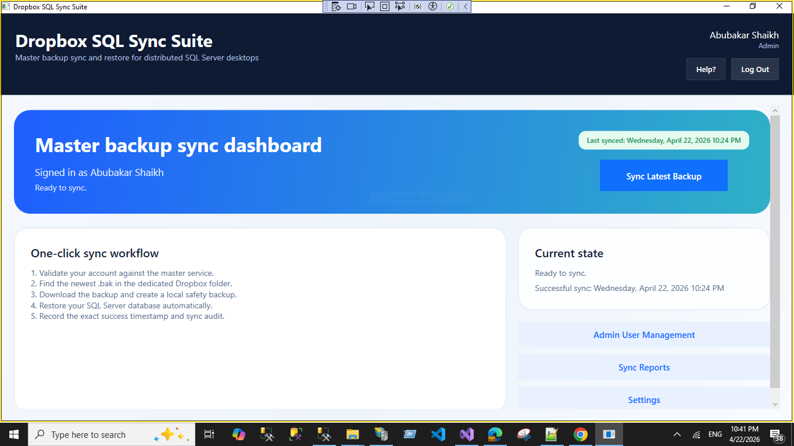
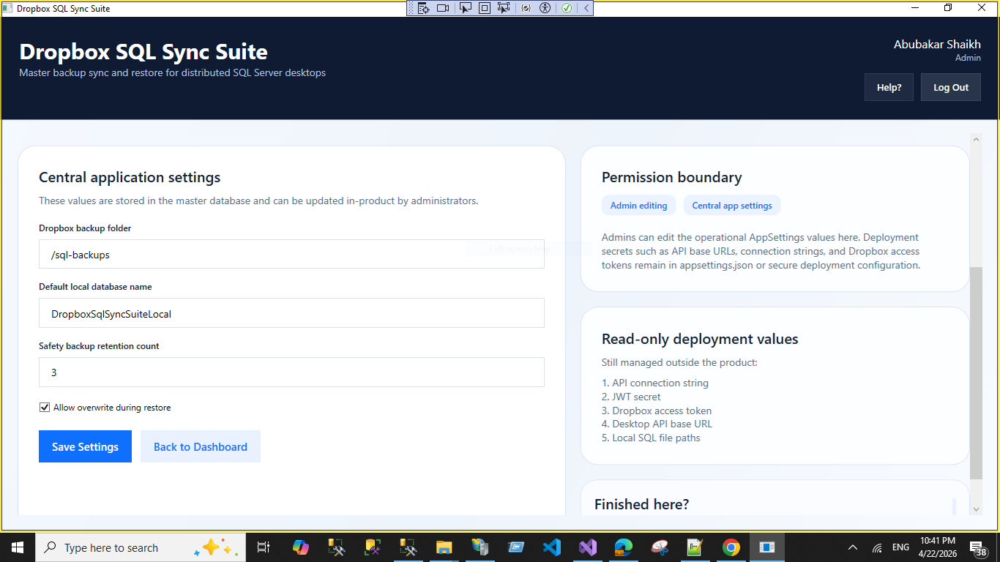
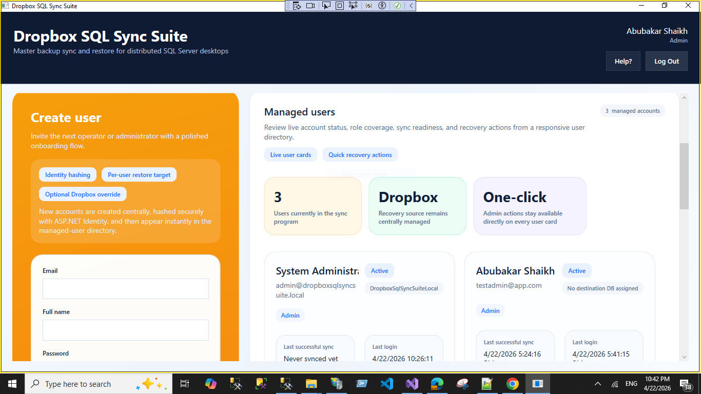
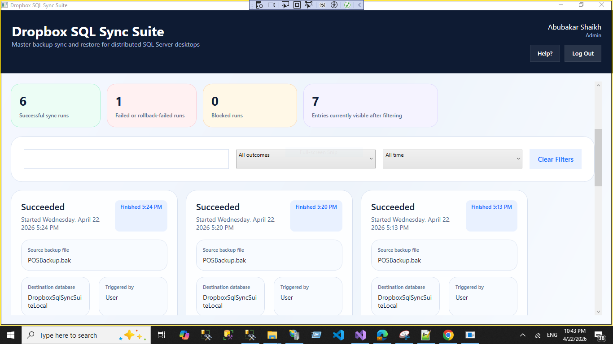
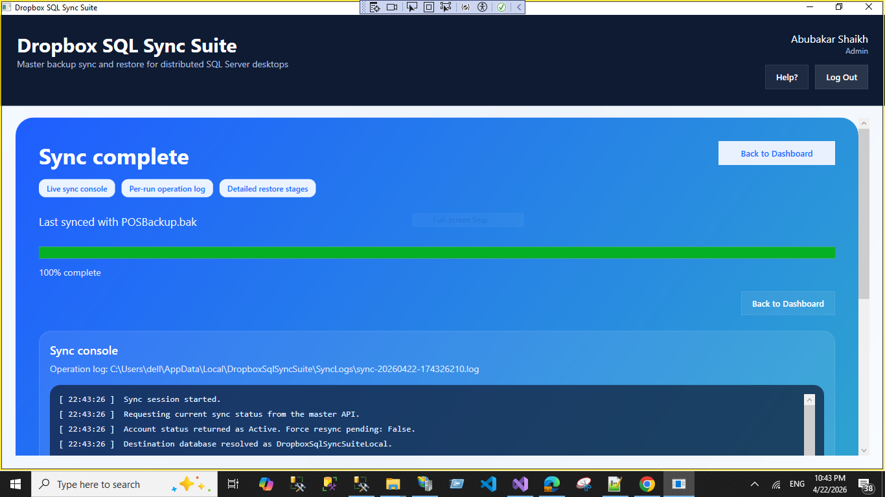
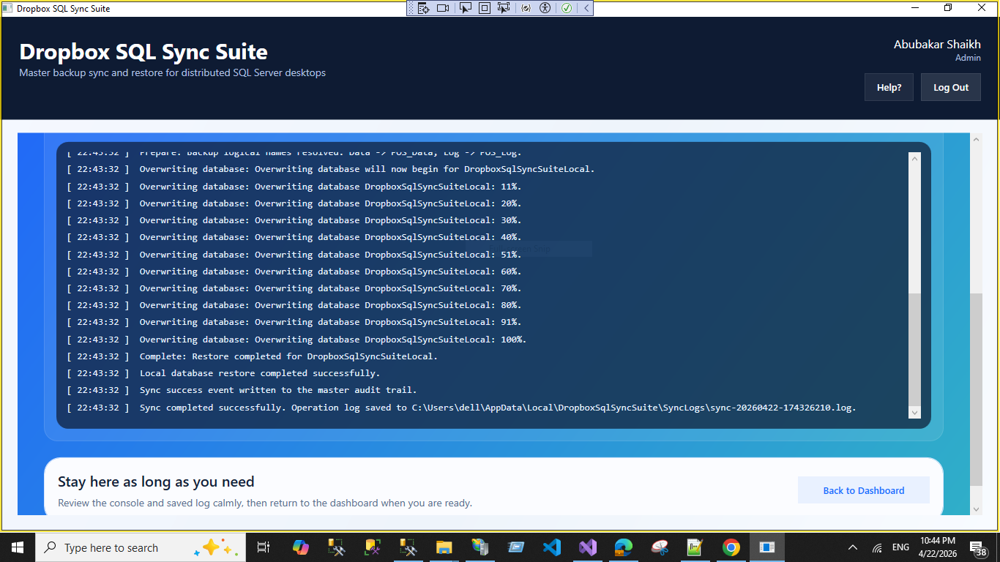

# Dropbox SQL Sync Suite

Dropbox SQL Sync Suite is a Windows 10/11 solution for centrally validating users, discovering the latest SQL Server `.bak` in Dropbox through the API, staging that backup securely, and restoring a local SQL Server database with one click from the desktop app.

It combines a WPF desktop client, an ASP.NET Core API, a shared master database, in-product administration tools, centralized Dropbox connectivity, sync/audit reporting, and guided restore workflows for distributed desktop environments.

## Highlights

- Central user validation with role-based access for `Admin` and `User`
- API-staged Dropbox restore flow so desktops do not hold Dropbox credentials
- Local safety backup before overwrite/restore
- Sync audit trail with success, failure, blocked, and rollback visibility
- Admin tools for user lifecycle management and force-resync workflows
- Admin-only Dropbox connect/disconnect flow with centrally stored refresh token
- In-product settings management for central, desktop, API advanced, and protected deployment settings
- Configuration-audit reporting for settings changes without exposing secrets
- Bootstrap-first admin creation flow for clean initial deployment

## Screens

### API



Swagger UI for authentication, sync, settings, and user-management endpoints.

### Desktop App

| Login | Dashboard |
| --- | --- |
|  |  |
| Sign in or register with a centrally managed account. | Launch the latest sync, view current status, and access admin tools. |

| Settings | User Management |
| --- | --- |
|  |  |
| Manage central app settings such as backup folder, default local DB name, and retention. | Create users, review status, and manage operator/admin access. |

| Sync Reports | Sync Progress |
| --- | --- |
|  |  |
| Review outcomes, filter sync history, and inspect execution details. | Follow the restore session with live console output and progress feedback. |

### Restore Log Detail



Detailed restore-stage output for overwrite progress, completion, and audit confirmation.

## Solution Layout

```text
DropboxSqlSyncSuite.sln
database/
  01_Create_MasterDb.sql
  02_Seed_MasterDb.sql
  03_Diagnose_Invalid_IdentityHashes.sql
  04_Reset_Invalid_Bootstrap_Admin.sql
docs/
  README.md
screens/
src/
  DropboxSqlSyncSuite.Api
  DropboxSqlSyncSuite.Core
  DropboxSqlSyncSuite.Desktop
  DropboxSqlSyncSuite.Infrastructure
  DropboxSqlSyncSuite.Shared
```

## Architecture Summary

- Desktop users authenticate against the API and never talk to Dropbox directly.
- The API owns Dropbox OAuth credentials and the centrally stored Dropbox refresh token.
- During sync, the desktop:
  1. checks `/api/sync/my-status`
  2. asks the API to stage the newest Dropbox backup
  3. downloads the staged file from the API
  4. restores the local SQL database
  5. writes sync audit history back to the API
- Admins manage users, Dropbox connectivity, settings, and configuration audit from the desktop UI.

## Tech Stack

- `.NET 9`
- `WPF` desktop client
- `ASP.NET Core Web API`
- `SQL Server`
- `ASP.NET Core Identity`
- `Dropbox API`
- `Serilog`
- `Swagger / OpenAPI`

## Prerequisites

- Windows 10 or Windows 11
- .NET SDK `9.0.x`
- SQL Server Express, Standard, or Developer Edition
- Dropbox app with API access to a dedicated backup folder
- Visual Studio 2022 or newer with `.NET desktop development` and `ASP.NET and web development`

## Getting Started

### 1. Create the master database

Run these scripts in order:

1. `database/01_Create_MasterDb.sql`
2. `database/02_Seed_MasterDb.sql`

The seed prepares roles and bootstrap settings, but it does not create the first administrator account.

### 2. Configure the API

Update `src/DropboxSqlSyncSuite.Api/appsettings.json`:

- `ConnectionStrings:MasterDb`
- `Jwt:SecretKey`
- `Dropbox:AppKey`
- `Dropbox:AppSecret`
- `Dropbox:OAuthRedirectUri`
- `LocalSql` values if you plan to use restore-related settings on the API host

Generate a JWT signing key in PowerShell:

```powershell
[Convert]::ToBase64String((1..64 | ForEach-Object { [byte](Get-Random -Minimum 0 -Maximum 256) }))
```

Build and run:

```powershell
dotnet restore DropboxSqlSyncSuite.sln
dotnet build DropboxSqlSyncSuite.sln
dotnet run --project src/DropboxSqlSyncSuite.Api/DropboxSqlSyncSuite.Api.csproj
```

### 3. Configure the desktop app

Update `src/DropboxSqlSyncSuite.Desktop/appsettings.json`:

- `Api:BaseUrl`
- `Dropbox:BackupFolderPath`
- `LocalSql:ServerName`
- `LocalSql:DatabaseName`
- `LocalSql:DataFilePath`
- `LocalSql:LogFilePath`

Run the desktop client:

```powershell
dotnet run --project src/DropboxSqlSyncSuite.Desktop/DropboxSqlSyncSuite.Desktop.csproj
```

## Bootstrap Admin Setup

The first administrator is created through a one-time bootstrap endpoint.

- Reserved bootstrap email: `admin@dropboxsqlsyncsuite.local`
- Flag: `Bootstrap:AdminRequired = true`
- Endpoint: `POST /api/auth/bootstrap-admin`

Example request:

```json
{
  "email": "admin@dropboxsqlsyncsuite.local",
  "password": "StrongPass123!",
  "fullName": "System Administrator",
  "localDbName": "DropboxSqlSyncSuiteLocal",
  "dropboxFolderPath": "/sql-backups",
  "deviceIdentifier": "HQ-DESKTOP-01",
  "deviceName": "HQ Front Desk"
}
```

On success, the API creates the first admin account, stores a real ASP.NET Identity password hash, and disables the bootstrap requirement.

## Dropbox Connection Setup

Dropbox is now connected centrally through the API instead of by storing an access token in the desktop app.

Before connecting Dropbox:

- configure `Dropbox:AppKey`
- configure `Dropbox:AppSecret`
- configure `Dropbox:OAuthRedirectUri`
- register that exact redirect URI in the Dropbox App Console
- enable at least:
  - `files.metadata.read`
  - `files.content.read`

Admin flow:

1. Start the API.
2. Sign into the desktop app as an admin.
3. Open `Settings`.
4. Click `Connect Dropbox`.
5. Complete Dropbox consent in the browser.
6. Return to the app and refresh settings.

Normal behavior:

- this is usually a one-time setup per environment
- users do not reconnect Dropbox per sync
- desktops do not need Dropbox secrets or refresh tokens

## How Sync Works

1. The desktop user signs in or registers through the API.
2. Before each restore, the desktop checks the user's sync status from the master service.
3. If the account is disabled or deleted, the app blocks access and attempts local cleanup.
4. If allowed, the desktop asks the API to stage the newest Dropbox `.bak`, downloads that staged backup, creates a safety backup, and restores the local SQL Server database.
5. The desktop writes the sync result back to the API audit trail.
6. `LastSuccessfulSyncAt` is updated only after a full successful run.

## Settings Workspace

The app now separates settings into clear admin-facing groups:

- `Central operational settings`
  - shared defaults stored in `core.AppSettings`
- `Desktop environment settings`
  - local desktop `appsettings.json`
- `API advanced settings`
  - API `appsettings.json` values such as token lifetimes, logging levels, and staging paths
- `Protected deployment settings`
  - connection string, JWT secret, Dropbox app key/secret, redirect URI, and refresh token

Protected values are masked by default, require stronger confirmation, and should generally be followed by an API restart.

## Reporting and Audit

- `Sync Reports` lets users and admins review sync outcomes, filter history, and open saved console logs for newer runs.
- `Configuration Audit` lets admins review sanitized configuration changes by group, actor, and timestamp without exposing secret values.
- Live sync runs show a console log on the progress screen and also write a per-run log file under `%LocalAppData%\DropboxSqlSyncSuite\SyncLogs`.

## IIS Warm-Start Recommendation

If you host the API in IIS, use these settings to avoid cold-start delays on the first desktop login:

- Application Pool `Start Mode` = `AlwaysRunning`
- Application Pool `Idle Time-out (minutes)` = `0`
- IIS app/site `Preload Enabled` = `True`
- Install IIS `Application Initialization`

## Dropbox App Configuration

- Create a Dropbox app scoped to the backup folder only
- Use the API-side OAuth connect flow instead of storing a manual long-lived access token in the desktop app
- Keep Dropbox credentials out of source control
- Store `.bak` files in the configured folder, for example `/sql-backups`

## Notes

- Protected desktop tokens are stored under `%LocalAppData%\DropboxSqlSyncSuite\SecureStore`
- Desktop logs are written under `%LocalAppData%\DropboxSqlSyncSuite\Logs`
- Per-sync console logs are written under `%LocalAppData%\DropboxSqlSyncSuite\SyncLogs`
- API logs are written under `%LocalAppData%\DropboxSqlSyncSuite\Api\Logs`
- Local SQL working files default to `C:\ProgramData\DropboxSqlSyncSuite\...`
- The cleanup flow assumes attached-file or explicit MDF/LDF deployments

## Additional Documentation

Detailed setup, database table purposes, Dropbox OAuth flow, advanced settings guidance, and first-run deployment notes are available in [`docs/README.md`](docs/README.md).
